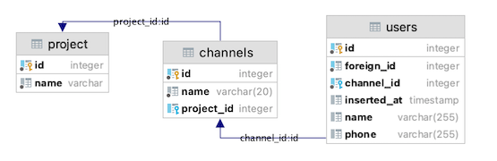

# RS DB Seeder

`RS DB Seeder` makes it easy to populate database tables for your tests.

## Motivation

When you have many dependent tables, it becomes difficult to create test data. Sometimes you need to test the function
of changing a user's email address, , but you need to create two more dependent tables because the user tables have 
constraints.



In order to create `user` you have to create `project` and `channel` records first.

```
const { rows: project} = client.query({
  text: 'INSERT INTO projects(name, description) VALUES($1, $2)',
  values: ['Foo Project', 'Bla bla bla'],
})
const { rows: channel} = client.query({
  text: 'INSERT INTO channels(name, project_id) VALUES($1, $2)',
  values: ['dev-hunour', project.id],
})
const { rows: user} = client.query({
  text: 'INSERT INTO users(name, phone, foreign_id, channel_id) VALUES($1, $2)',
  values: ['brianc', '555-555-555', 123 channel.id],
})
```

rs-db-seeder allows you to do it in just one step

```
await dbSeeder.insert("user", { name: "john" });
```

**Any missing information**(phone, foreign_id fields) **will be added and dependent records** (channels, projects) 
**will be automatically created** behind the scenes.

# Getting Started

### DB Adapter

`rs-db-seeder` is framework agnostic. It doesn't use specific ORM - like knex, typeorm, sequelize. So you will need 
to build your own simple adapter for you application. The adapter implements `IStorageWriter` and has only one 
method `insert`.

Here's a simple `knex` adapter for `pg`.

```typescript
export class KnexStorageWriter implements IStorageWriter {
    private knex: Knex;
    constructor(knex: Knex) {
        this.knex = knex;
    }

    insert = async (tableName: string, data: any) => {
        const [result] = await this.knex(tableName).insert(data, '*');
        return {
            ...result,
            ...data,
        };
    };
}

const knex = configure();
const storage = new KnexStorageWriter(knex);
const dbSeeder = new DbSeeder(storage);
```

### Setup factories

Now that we have an adapter, we need to configure `rs-db-seeder`, so that it can generate test data and know about 
the dependent tables.


```typescript
/**
 * Adds new factory
 * @param {string} name - factory name, i.e. user, post
 * @param {string} tableName - table name, i.e. users tbl_user etc
 * @param {DataProvider} dataProvider - data provider callback
 * @param {string} id = "id" - ID column name, by default id
 */
dbSeeder.addFactory("channel", "channels", (data: any = {}): any => {
    return { name: "channel_1" };
});
dbSeeder.addFactory("user", "users", (data: any = {}): any => {
    return {
        id: faker.random.number(999999),
        channel: ref("channel"), // references to the another factory
        foreign_id: faker.random.number(999999999),
        name: faker.name.findName(),
        phone: faker.phone.phoneNumber(),
    };
});
```

# Usage

## Build 

Build operation allows you to build fake data for your entity. Data is not written to the database. It is somewhat 
like a faker, it just builds data for the entire entity. Note: data for referenced tables 

```typescript
const data = dbSeeder.build("user", { id: 100 });
    // {
    //   id: 100,
    //   name: 'John',
    //   phone: '55555555',
    //   foreign_id: 2132323
    // }
```
Note: data for referenced tables is not added. At the same time, no one bothers to add them ourselves.

```
const data = dbSeeder.build("user", { id: 100, channel: dbSeeder.build("channel") });
    // {
    //   id: 100,
    //   name: 'John',
    //   phone: '55555555',
    //   foreign_id: 2132323
    //   channel: {
    //     name: "my channel"
    //   }
    // }
```

## Insert

`dbSeeder.insert` - will build and write data to the DB. Note: it's async method. All referenced fields will be built
and inserted as well, i.e. we will do 2 inserts into (ref) channels and users

```typescript
const data = await dbSeeder.insert("user", { id: 100 });
   // {
   //    id: 100,
   //    name: 'John',
   //    phone: '55555555',
   //    channel_id: 60,            // channel with ID = 60 has created
   //    foreign_id: 2132323
   //  }
```

### References

If you created a dependent entity before, pass it as a pass it as a simple column value

```
const channel = dbSeeder.build("channel" });
const data = dbSeeder.build("user", { id: 100, channel_id: channel.id });
```

if you pass data as an object 
```
const data = dbSeeder.build("user", { id: 100, channel: { name: "my channel"} });
```
`{ name: "my channel"}` will be passed to channel `insert` method.